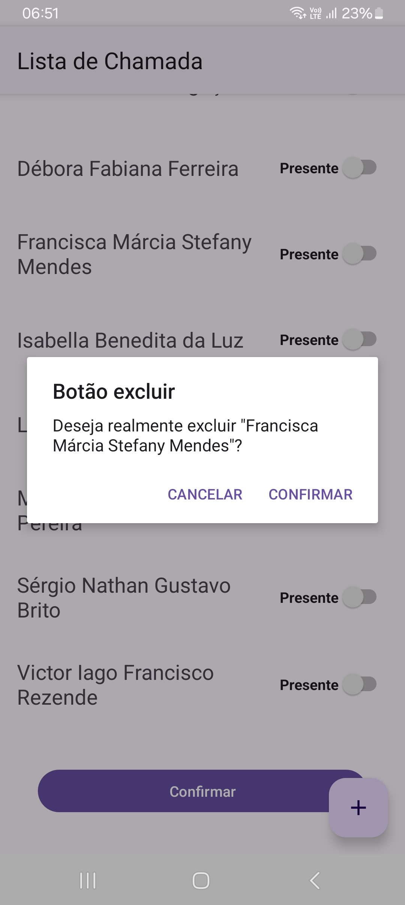

<h1>Lista de chamada</h1>

<h3>Aplicação android kotlin que implementa sistema de lista registro de faltas</h3>

<h2>Realização de registro de faltas</h2>

A aplicação consiste em um sistema que realiza o registro de faltas em uma lista de presença, autenticando o usuário que realizou a chamada e capturando a data e hora.

  

<h2>Validação de cadastro</h2>

Para validação de dados, aplicação implementa um sistema que não permite realizar cadastro com o nome em branco.

  

<h2>Menu excluir</h2>

Para exibir o menu o excluir, a aplicação implementa um sistema de clique longo que melhora a experiência do usuário.

  

<h2>Caixa de dialogo de confirmação de exclusão</h2>

Para oferecer proteção aos dados, a aplicação implementa um sistema de caixa de dialogo onde o usuário deve confirmar a ação realizada antes da transação.

  

