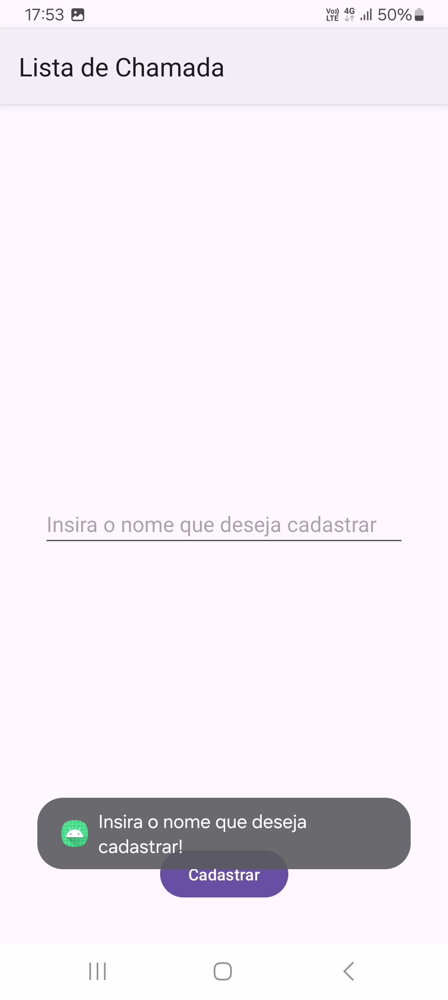

<h1>Lista de chamada</h1>

Aplicação android kotlin que implementa sistema de lista registro de faltas

<h2>Realização de registro de faltas</h2>

  

<h2>Validação de cadastro</h2>

  

<h2>Menu excluir</h2>

  

<h2>Caixa de dialogo de confirmação de exclusão</h2>

  

